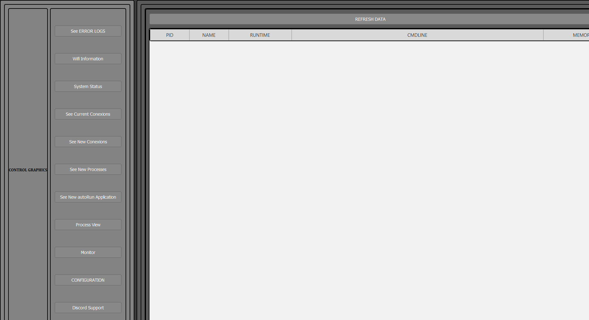
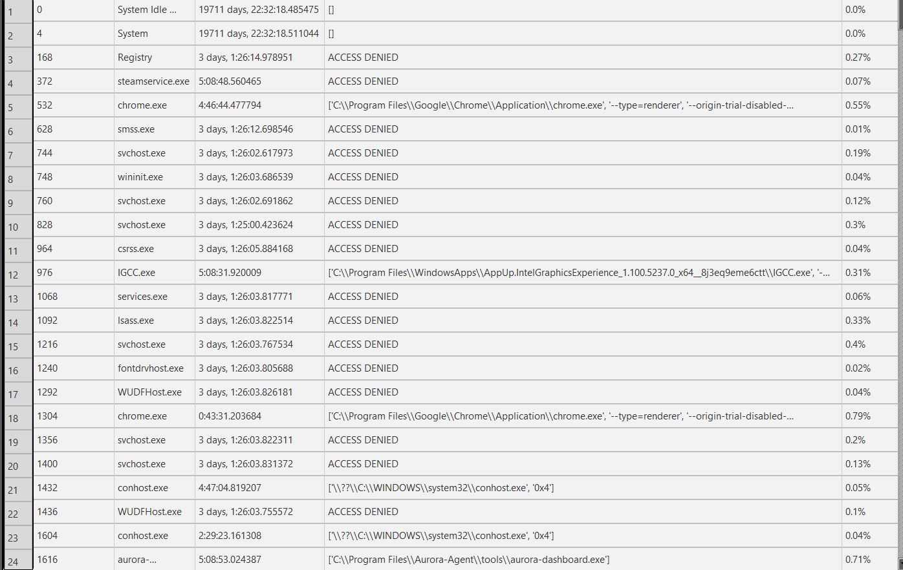
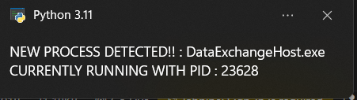
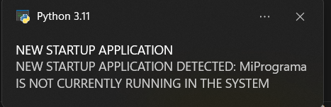
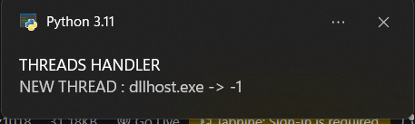

A secure control center APP
Features :
    -Detect New AutoRun application
    -Detect New threads of application being launched
    -Detect New processes of applications being launcher
    -Detect New Conexions
    -Detect New Windows Versions
    -Monitor button super basic information (will be upgrade it)
    -Configuration button
    -Networking options
    -View process list button
    -View Conexion list button
    

UI view Image 

Process View Image

Configuration View Image

Detect Images Part

New Process Detected Image 

New StartUp Detected Image

New Thread Detected Image

New Conexion Detected Image

